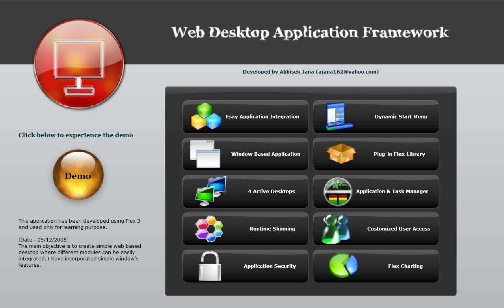

# Web Application Desktop Framework

In the advent of Web 2.0 era I was on steroids to fully utilize the newer tools and technologies. Adobe Flex was the magical tool which helped me to materialize my vision. Many enterprise applications were still using vanilla javascripts and porlets for rendering the UI. 

I created an opensource framework using Action Script 3 and MXML which will enable full windows capabilities in the browser, something like having Visual Basic in the browser. However all the complexities are embedded in the framework so that developer can just extend the library and the features will be automatically added. I pretty much replicated how windows works internally, like every application will have an entry in task manager, the windows can be minimized or maximized, interdependencies between parent and child windows etc.

I initially uploaded the demo ( a much richer version that what’s given below ) and there were more than million views in just a week. In 2008 it still was a big thing as I never had any online presence. I started receiving emails from around the globe on sharing the code. 

Since adobe is sunsetting Flash by end of 2020, I have decided to provide my tribute by sharing some of the early concepts and code. 

It's my pleasure to say that this framework was reviewed and approved by [Yakov Fain](https://yakovfain.com/) (Java Champion) to be used across enterprise. There are applications still up and running using this framework in production system ( more than 12 years now) without any issues.

Here is a very early demo of the framework.

[Youtube Video of the same](https://youtu.be/wSkkoC40HIw)

## Features

Below is the page I used to open the actual demo.

### Window Based Application
- Completely windows-based environment.
- All windows can have minimize, maximize, close, restore, resize, zoom out & zoom in buttons.

### Easy Application Integration
- The application integration very easy and generic.
- All the applications can be developed as a seperate Flex library project and the the framework will load the appropriate application configured in a xml file.
- Any Application can talk to another application, transfer objects and also can open child windows and communicate with them. 
- UI elements can also be draged and droped to a dedicated window defined by the developer. This way data can be transferred between two applications.

### Dynamic Start Menu
- The StartMenu is completely dynamic and generated based on user authorization model retrieved from server.
- The StartMenu dyanamically loads the application after user clicks on the menu item

### Plugin Flex Library
- Different applications can be developed as seperate project and just the library can be imported, no extra coding is required. 
- The framework can dynamically load individual applications. This will reduce the startup time.

### 4 Active Desktops
- This is one of the most complex feature. The framework allows users to work with 4 active desktops. 
- User can move their application from one desktop to another.

### Application and Task Manager
- This integrated tool shows all the applications opened in different desktops and allows users to move any application from one desktop to another. 
- This tool also shows the graphical plot of the memory uses by Flex runtime. 
- User can also kill or open any new applicaion from TaskManager.

### Additional Features
- Runtime Skinning
- Customized user Access
- Application Security
- Advanced Charting

## Running the Demo
You can still run the demo by opening the /demo/bin-debug/App2Demo.html file in internet explorer.  This was coded using Flex 3. 

## Featured Emails

I had received many many emails from around the world. Here are few of them which I still could find in my old inbox.

> "Congratulations and good luck with your Flex Web Desktop Framework app. It is very unique. Are you selling this as a product? If so, how much are you asking? Also, we are about 18 months into the large development of a project for a non-profit endeavor. We expect to launch it in September. We are using a metaphor like your pop up windows similar to what happens when you click on your task manager button in the demo. We are having trouble getting the min, max, and close buttons to show up on MACs running both Safari and Firefox with the latest version of  the Flash Player 9. Did you write your own pop up window component or did you modify some existing code? If you did build your own component would you consider selling it or letting us use it? I thinks yours runs a bit faster than ours and it operates fine on a MAC. It would save us some debugging time this late in the game." - Scott

> "Nicely done. I would love to take a look under the hood at the source code to see how you were able to address some of the features." - Bob Tate

> "It’s really a great work. I’m a beginner working with flex and i need something like that for develop a trial application. it’s possible you contact me in order to talk your source code?" - Manel

> "Coul you please, give me a url where i could have a closer look at the final result of your development.P.S. I'm a Software Engineering and i think this framework could be very usefull in the project i'm working on [so you can make some money from it :)].I'm looking to hear you." - Annonymous

> "I found on several pages references to your work on a FLEX Web Desktop Application Framework.Unfortunately, http://abhisekjana.elementfx.com/ doesn’t work anymore.As we intend to develop a web desktop application I want to know more about yours: is your code open source / or do you sell it? What limitations do you have, etc…" - CTO, KeepCore SARL

> "We have recently came across your Web OS style, FLEX application that can be found at http://abhisekjana.elementfx.com/. We were very, very impressed by the application and we are currently building a Web based operating system. We are a little confused to weather is open-source and the project files can be downloadable or not. We are very intrested in using your suberb frameworks to deploy our FLEX application." - Dom

> "I am so amazed how you do this stuff. I am new flex and I've been developing java applications for many many years. I'm switching in Flex to replace the Java Swing framework.I've been looking around docking framework and finally found one that you've developed. I do love everything.. Is it possible for you to share the code for this? " - Kit

> "I saw the demo of your desktop and I am really impressed. ( http://abhisekjana.elementfx.com/) Everything looks very attractive, cool and perfect. I have some graphic experience but I want to learn Flex and actionScript 3.0. I was wondering if you could give me some tips on developing something similar, also for learning purposes. For instance, did you have to write all of the code for the drawing of the windows with the icons in the corners, etc or was this part of an existing framework that you used as a base to develop your desktop applications?Do you have any plans to share your code under a GPL license or non-disclosure aggrement?" - Normand

> "I Saw your work on http://abhisekjana.elementfx.com/ and it's really nice, do you have time to revenp a web application in flex? We have a Web Billing app that we are transfering to Flex 3 and I am looking for the look and feel of a desktop app.how do you want to processed ... shares in the company or be paid. the company is a start up www.epowerbilling.com" - Abdellah

> "I  just saw the demo using the below link and its really good. http://abhisekjana.elementfx.com/ After a long wait I found right technology to work on… I am FLEX starter. Can you help me with source code of the application if you don’t mind?" - Narayan

> "Hello, I just took a look at your application/demo that was developed using Abobe Flex3 .You did a really good job with the project/application. I would like for you to build/develop a application for me using flex. Please give me a call at XXX-XXX-XXX or we reached using VoIP. I look forward to hearing from you soon." - Melvin

> "I've seen your's web desktop and find that very interesting. Do you plan to open the code ?? I've been working with creating such application for web. And I've been using extjs - but now I've switched to flex and looking for such framework." - Ilya

> "I found your Flex application on Flex.org.  I was wondering if you had a blog or any information website setup to discuss your code and best practices?  I am very new to Flex and would like to work towards developing a application like what you have done.  I like the idea of the desktop which is very familiar to users and the fact that modules can be separated as different projects." - Josh

> "I have seen your demo web desktop 2.0 on http://abhisekjana.elementfx.com/mainapp/demo.html. This mail is an appreciation of your work. I am sure you already have got lot of accolades for the cool demo you have built. I was particularly very impressed by the demo. I have been working in ******** for last 6 years on Java/J2EE projects. A few months back I have read about adobe flex and i am trying my hands on it in my leisure time and make a proof of concept so that I can convince my client to go for it. I just wanted to ask you that could you take out some time from your schedule and lend a guiding hand to me, for building a rich web interface, or atleast point me to resources and links, because i am a novice in this area. A reponse from you is eagerly hoped and would be highly appreciated." - Anindya

> "I just wanted to appreciate the work on http://abhisekjana.elementfx.com in FLEX. good job....I used to work in **** until a month ago, which is where i heard about the FLEX stuff, but couldnt get a chance to work on it. I am trying to learn FLEX and could definitely use a little guidance from you. I would appreciate if you can please give me a call at your convenience." - Uday

> "I have seen your work from the flex.org and I was wondering i you are interested in doing some business together.I have a big Web 2.0 Flex website being developed and I want someone to get the UI interface and graphics done for me, would you be interested in such a task?" - Tareq

> "Had a look at your development works at, http://abhisekjana.elementfx.com/mainapp/demo.html. Its very impressive. I am a beginner in adobe flex and it would be great if you could provide me some sample codes/source codes for developing such a desktop. Any pointers or study materials would be helpful." - Gokul

> "This is search engine marketing company of South Korea. And I'm a service development junior manager. My boss saw your application demo site today. (http://abhisekjana.elementfx.com/). And he asked me to contact you. Because your applications seem to apply our system. So, we would like to see more details. And your each elements are on the market? If it is on sale, I wonder the price. Please introduce your profile or application. Thanks for reading. And I will waitng for your reply." - Cho

> "Hi Abhisek, I have looked into your demo Web Desktop Application Framework, and I have to congratulate you for the great work you have done. I found it very interesting. In fact, I was thinking of creating something similar. That is why I am contacting you, because I was wondering what you are going to do with it. Are you going to release it to the public domain? Would you be willing to share your experience? I look forward to hearing from you." - Fidel

